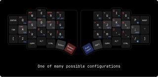

    
    <h3>Anywhy Flake</h3>
    
<i>be productive, stay healthy and enjoy the process.</i>

# Why

By the 19th century, a need for a faster way of writing had emerged, which led to the invention of typewriters. Two centuries later, modern keyboards don't look much different from their predecessors, even though such design has been proven to be quite inefficient and often harmful.

Addressing these problems leads to huge benefits considering how often people use keyboards in the modern world.

# How

## Split

Regular keyboards are made in a single monolithic block, and the main problem is that such a form factor requires our forearms to meet in the center. To compensate for this, wrists are bent apart. This position creates an unnatural angle between the forearm and the wrist, which in the long term will likely lead to constant wrist pain.

Each half of the split keyboard can be rotated and placed in any suitable way so everyone can adapt the setup to their personal preference, avoiding potential damage to the wrists. As a bonus, we get free space right between the halves which can be occupied by a trackpad, coffee, or even a cat =^..^=

## Stagger

If you take your hand and look at the fingers, you can notice that they are positioned horizontally. Now take a look at your keyboard - the keys are grouped in arrays that are shifted vertically, known as row-based stagger.

This well-known layout forces your fingers to move in a counterintuitive way. The solution to that problem is simple: we need to rearrange the keys in a more human-friendly way.

As you can see, Flake has what's called a column-based stagger. Because of this, keys are located in the path of natural finger movement, which results in a much more pleasant typing experience and reduced fatigue.

## Key switches

There are a huge amount of various keyboard switches with different feel, size, sound, height and so on. Such variety is awesome, but the problem arrives when you have to chose one.

To address this issue, Flake utilizes hot-swap sockets. There are two different sockets per key, allowing you to use any Cherry MX and low-profile Kailh Choc switches. This way, you can always experiment with the look and feel of the keyboard and change it according to your mood.

## Keys amount

There's a high chance that some might feel confused seeing such a small number of keys, considering user productivity is one of the priorities for Anywhy.

Indeed, Flake has fewer keys than most conventional keyboards, and that's not a compromise, but a feature. A large number of keys causes hands to move around to reach further-placed keys.

Having fewer keys doesn't mean less functionality. In fact, Flake is not only fully input-compatible with regular keyboards but also allows you to add more keys than most keyboards have. All thanks to [ZMK Firmware](https://zmk.dev) and its features such as [layers](https://zmk.dev/docs/keymaps#layers).

### Flake L

There's a Flake L with 58 keys for those who aren't ready to jump down the rabbit hole yet or just prefer more keys.

### Flake S

For people who strive for absolute comfort and compactness, there is also Flake S with 40 keys.

## Thickness

The keyboard has been designed to be as thin as possible while maintaining a sturdy construction.

The keyboard body is only ~0.8 cm (without feet), which combined with the low-profile switches and caps, greatly enhances comfort.

# What

Flake supports both wired and wireless (Bluetooth) connection, which makes it perfect for both home usage with a PC or portable setup with a laptop, tablet, or even smartphone.

To achieve both types of connectivity, each half has two USB-C ports, one on the top and one on the inner side. The side port is used to connect the halves together, and then one of them (usually the left one) can be connected to any device using the top port, which is also used to charge the keyboard.

> Ports on the side are used only to communicate with each other, so they can't be used to charge the keyboard or to flash the new firmware

The keyboard allows for a maximum battery capacity of 200mah. On a single charge, the left half will last ~1 month and the right half will last over 4 months when used for 6 hours every day.

> The calculations are done with the nice!nano controller.

In order to use MX Switches, the special "plate" comes with the Flake which should be placed between the board and the switches.

# Build

If you want to build the keyboard yourself, check out [Guide](./docs/build_guide.md), which describes everything you need to build your own Flake. 

Also, make sure to check out the [Gallery ✨](./docs/gallery.md) with awesome Flake builds.

# Credits

Huge thanks to:

- [@foostan](https://github.com/foostan), the author of [Corne Keyboard](https://github.com/foostan/crkbd) which was my introduction to the world of ergonomic keyboards.
  
- [@pashutk](https://github.com/pashutk), the author of [Chocofi](https://github.com/pashutk/chocofi), an amazing tiny keyboard I've been using for a while.
  
- [@ebastler](https://github.com/ebastler/) for his amazing [marbastlib](https://github.com/ebastler/marbastlib) which is being used as the basis for footprint switches

- [@josefadamcik](https://github.com/josefadamcik), the author of [Sofle](https://github.com/josefadamcik/SofleKeyboard) which gave huge inspiration for the Flake's key layout.
  
- [@petejohanson](https://github.com/petejohanson) for creating [ZMK Firmware](https://github.com/zmkfirmware/zmk) and all the [contributors](https://github.com/zmkfirmware/zmk/graphs/contributors) that make it better each day.

- Everyone working on [KiCad](https://gitlab.com/kicad/code/kicad) and [FreeCAD](https://github.com/FreeCAD/FreeCAD), for creating such powerful open source tools

- People from the [ZMK discord server](https://zmk.dev/community/discord/invite) for being so kind while helping me learn how to design PCB and how to debug and solve various problems.

- Finally, thank you to everyone who explores unpopular technologies, digs into niche topics, and makes amazing things possible.

## Stars

Your stars give motivation to keep improving the project :)

