# How to Build the Flake?

## Components

To build the Flake, you'll need the following materials:

| Name                  | Count     | Remarks                              |
|:----------------------|:----------|:-------------------------------------|
| PCB                   | 1 set     |                                      |
| MX hot-swap sockets   | 40/46/58  |                                      |
| Choc hot-swap sockets | 40/46/58  |                                      |
| Diodes                | 40/46/58  | 1N4148 SOD-323                       |
| Switches              | 40/46/58  | Choc V1/V2 or MX switches            |
| Keycaps               | 40/46/58  | Compatible with your switches        |
| Controllers           | 2         | Any ProMicro-compatible controller   |
| USB-C ports           | 2         | 6 pins, mid-mount 1.6mm ([example](https://www.lcsc.com/product-detail/USB-Connectors_BXCONN-UC19-0B06F65011_C36936556.html))|
| Reset buttons         | 2         | TS-1289VE-4                          |
| Enclosure             | 1 set     |                                      |
| Plates                | 1 set     | Required for MX switches             |
| M2 Screws             | 8         | Flat countersunk 8mm (e.g., DIN965)  |
| M2 Hex nuts           | 8         | DIN439 (thinner than regular)        |
| Rubber feet           | 8         | 6x2mm                                |
| Battery sockets       | 2         | JST 1.25 with straight pins          |
| Batteries             | 2         | 402030 (or smaller) with JST 1.25    |

[Here](essential_files.md) you can read where to find all the files you need for the PCBs and enclosures manufacture.

> **Note**: MX switch plates and batteries are optional depending on your build:
> - Skip the plates if are going to use only Choc switches
> - Omit batteries if plan to use Flake only by wire

# Assembly

> ⚠️ **Important**: The soldering process can be challenging, especially for beginners. This guide is structured to tackle the most difficult parts first to minimize component waste if something goes wrong. I recommend reading the guide completely before starting assembly. For first-time builders, having spare PCBs and parts is advised.

## Preparing the PCB

The PCB consists of two halves connected by breakaway tabs.

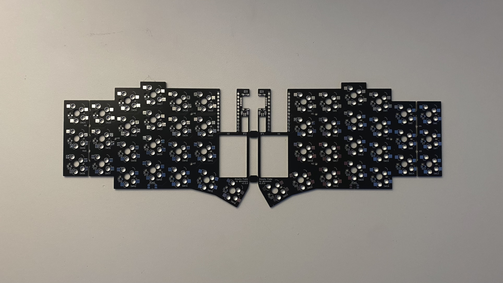

Carefully separate the halves using pliers. Handle the top section with extra care - it remains fragile until the controller is installed.

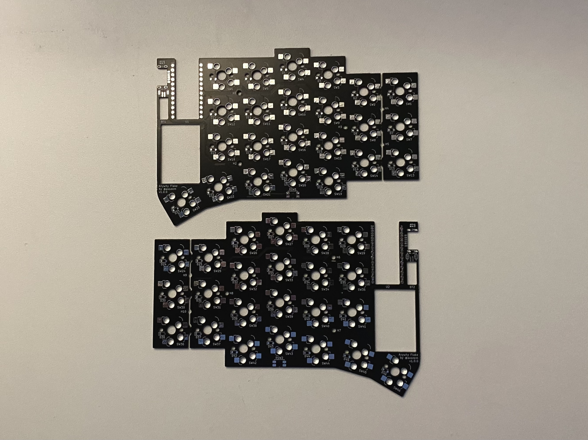

Since the assembly process is identical for both halves, this guide will focus on building one half. Simply repeat these steps for the second half.

Select the PCB half you'll assemble first.

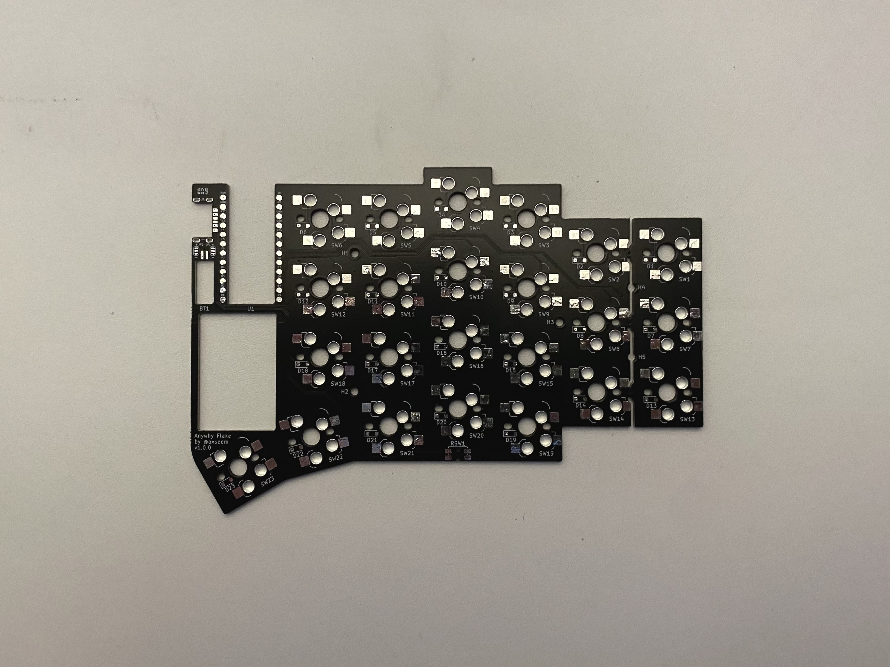

If you're building the S version with 40 keys, now is the time to remove the outer column. To do this, hold the PCB with the bottom side facing you (as shown in the previous image) and gently fold it toward you until it breaks.

For M or L versions, keep the PCB as is.

## USB Port

> **Note**: The outer pins and legs are connected to the GND (Ground) net, which contains substantial copper and requires more heat to solder properly. To ensure good connection, use additional flux and slightly increase the iron temperature, but avoid keeping the iron on the pad for too long.

Place the USB-C port in the appropriate cutout marked as J1 or J2, depending on which half you're working on. Ensure the port's back sits flush against the PCB.

Apply a small amount of flux over the pins. Touch each of the six pads briefly with your soldering iron tip and solder wick. Use just enough solder to secure the port without creating bridges between pins.

If bridges occur, apply flux and remove excess solder with your iron.

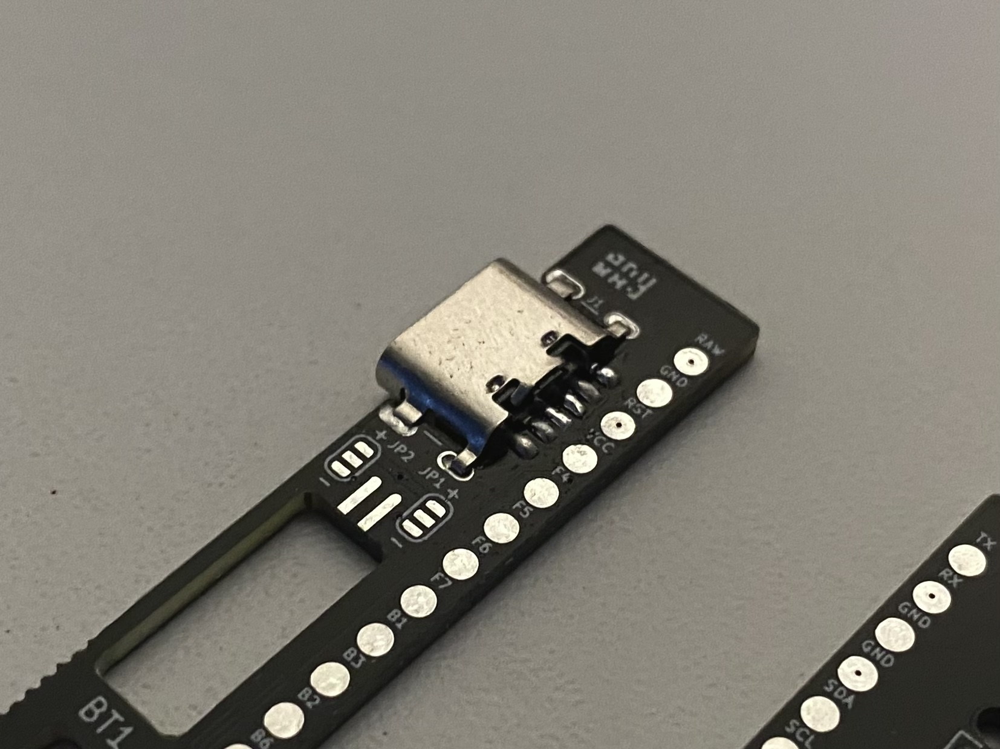

After soldering the pins, flip the PCB and solder the legs. Hold the iron over each hole for a few seconds to allow the solder to flow into it. Use a moderate amount of solder so it will not stick out of the PCB surface.

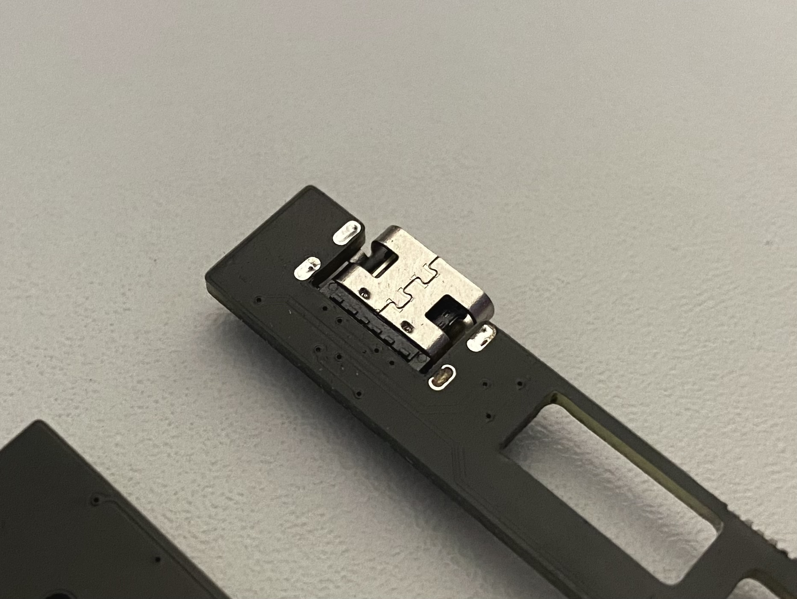

> **Tip**: A good practice is to test the connections with a multimeter after soldering. The pins are symmetrically connected to the nets:
>
> | Pins | Net | Description |
> |------|-----|-------------|
> | 1, 6 | GND | Ground      |
> | 2, 5 | VCC | Power       |
> | 3, 4 | RX  | Data        |
>
> Locate these network names on the controller pads and verify proper connections.

## Battery Connector

Add solder to one of the long connector pads and apply flux. Insert the JST 1.25 socket into the BT1 hole (or BT2 for the other half) with the cutout facing downward. Hold the connector with tweezers, ensuring the legs lay flat on the pads. Apply soldered iron tip to the leg above the pre-soldered pad. Once one leg is secured, solder the second leg.

Verify the connector sits parallel to the PCB. If needed, reheat the legs to adjust position. Check for any bridges between legs.

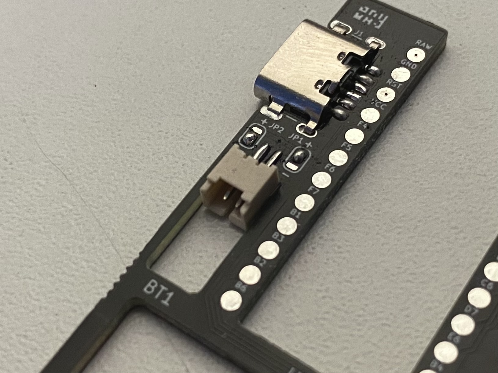

Next, solder jumpers JP1 and JP2 (or JP3 and JP4, depending on the half). First, insert the battery into the socket and note the wire polarity from left to right. Remove the battery and solder the jumpers accordingly. For example, if you noted black (negative) then red (positive), solder the center and bottom pad on the left jumper and the center and top pad on the right jumper.

> ⚠️ **Warning**: Incorrect polarity can damage both controller and battery. Double-check all connections before proceeding.

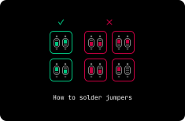

## Reset Switch

Position the reset switch at the bottom of the PCB in the RSW1 (or RSW2) location. Apply flux to the pins and carefully solder them using solder wire. Remove the excessive solder.

> **Note**: Two of the four pins connect to GND, so don't hesitate to use plenty of flux.

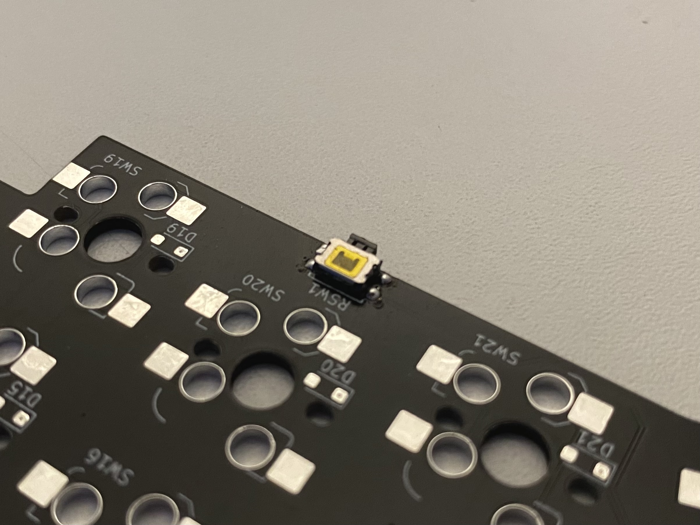

## Initial Sockets

Before mounting the controller, solder the sockets adjacent to it. These become difficult to access once the controller is in place.

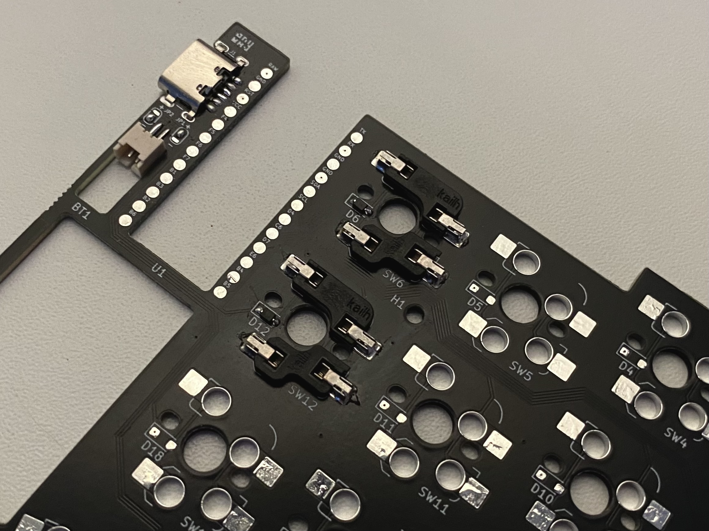

## Per Key Components

Each key requires one diode and two sockets. Begin with the diode installation:

1. Apply solder to one pad
2. Using tweezers, hold the diode while heating the solder
3. Place the diode ensuring correct polarity
4. Once secured, solder the remaining leg

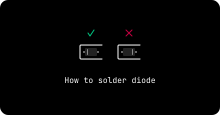

After the diode is installed, mount the sockets (MX on top, Choc on bottom). Hold the soldering iron at approximately 45° to the table and insert it into the socket's side leg. Feed solder just below the tip to ensure even distribution. Repeat for the other leg and second socket.

## Controller Installation

Position the controller in the cutout labeled U1 (or U2). Use the silkscreen and top holes for proper alignment.

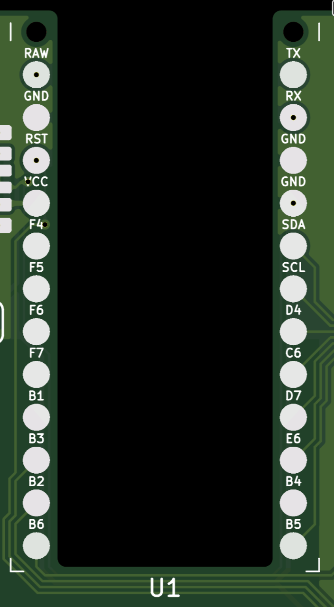

For optimal results, temporarily insert pins in the top two holes without soldering them. This helps maintain position during soldering.

Begin by soldering opposite corners, preferably choosing pads with minimal copper (aka not GND or RAW). I prefer B6 followed by TX pad.

Apply flux generously to the chosen hole. Insert solder wire and touch both the hole ring and solder with the iron tip. Push the wire in until all the solder is absorbed. Melt the joint and press down on the controller with the tweezers. Repeat for the opposite hole. When done correctly, the controller should sit flush against the PCB.

> Tip: Since direct pad contact is difficult, consider using a hot plate during soldering. Alternative heating methods (like a regular fan) can help. When filling holes, keep the iron in place for several seconds to distribute heat evenly. To avoid controller damage, touch only the solder bubble, not the hole ring.

After securing the controller, remove the temporary legs and solder all remaining holes. Use plenty of flux. After soldering all connections, apply flux and remove any excess solder with the iron.

The controller should sit flat with no protruding solder.

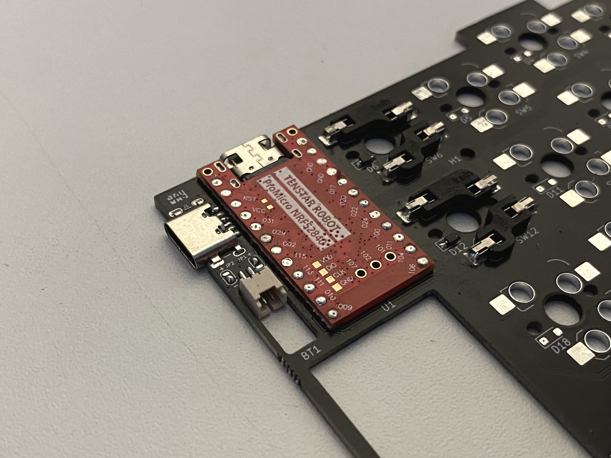

## Remaining Diodes and Sockets

Complete the installation of remaining diodes and sockets following [the same process as before](#per-key-components). It's recommended to install all diodes first, then proceed with socket installation.

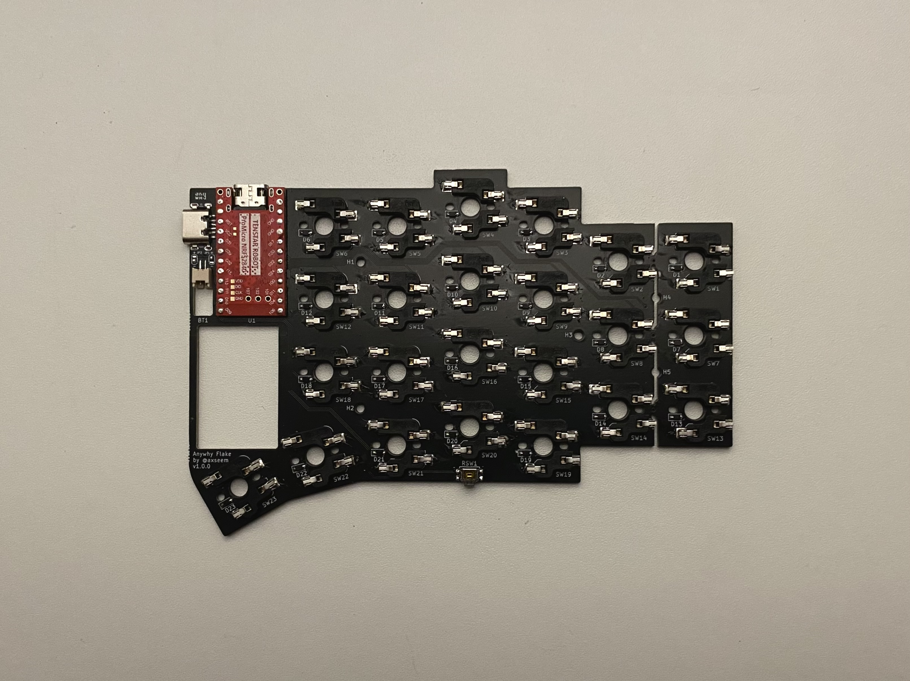

## Enclosure Assembly

Place the PCB in the enclosure as shown. Carefully connect the battery, avoiding vertical force on the JST connector to prevent damage. Position the battery in its designated cutout and route wires to avoid interference with the lid.

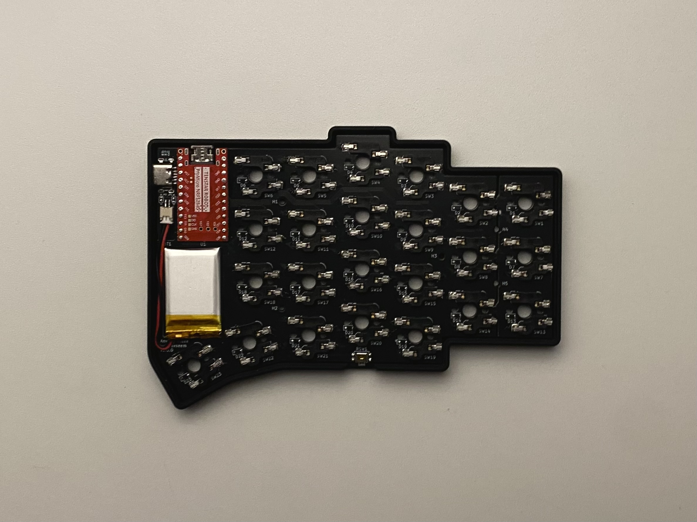

Place the lid and ensure it sits evenly. Insert hex nuts into the holes, compress the enclosure, and insert screws from the bottom. Add rubber feet, positioning them oppositely on the second half to eliminate gaps when halves are placed back-to-back.

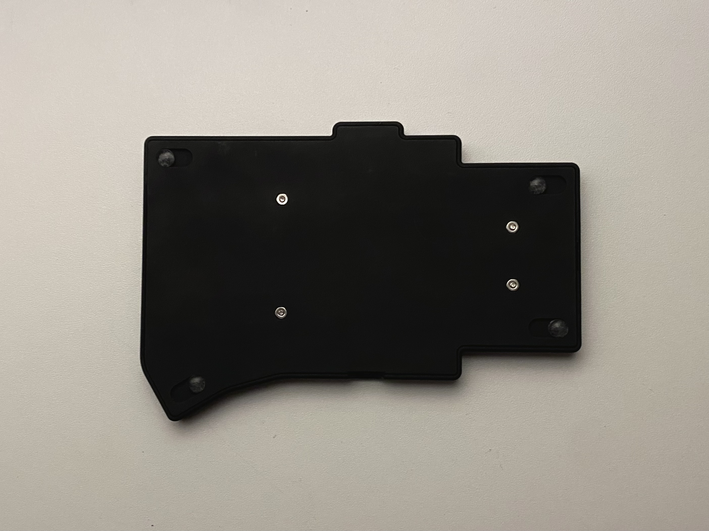

Repeat the entire process for the second half.

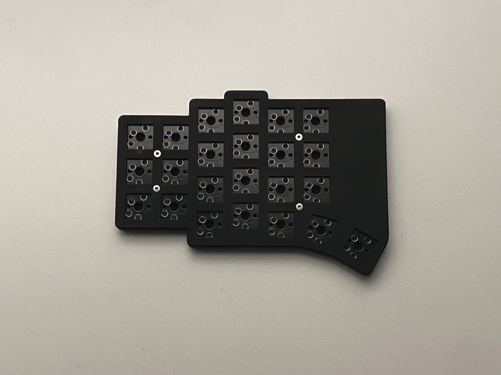

## Final Assembly

Insert your chosen switches into the appropriate sockets (MX in top socket; Choc in bottom socket). Attach keycaps to complete the physical assembly. To make your Flake fully functional, you'll need to flash the firmware - refer to the [flashing guide](flashing_guide.md) for instructions.