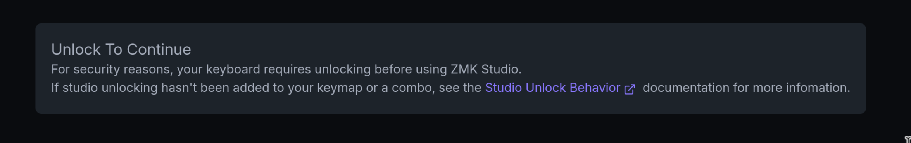

# How to Flash the Flake?

## Getting the Firmware

Before your keyboard can function, you'll need to flash it with the appropriate firmware. The firmware is available in the [GitHub repository](https://github.com/anywhy-io/flake-zmk-module).

To download the firmware:
1. Visit the repository's [Actions page](https://github.com/anywhy-io/flake-zmk-module/actions)
2. Select the most recent successful build (indicated by a green checkmark)
3. Download the firmware package

## Flashing Process

### Left Half
1. Connect the left half of your keyboard to your computer via USB
2. Press the reset button twice quickly to enter bootloader mode
   - The keyboard will appear as a storage device in your file manager
3. Locate the firmware file beginning with "anywhy_flake_left..." (with `.uf2` extension)
4. Copy this file to the keyboard's storage device
   - The device will automatically disconnect once flashing is complete

### Right Half
1. Disconnect the left half and connect the right half
2. Repeat the same process using the file beginning with "anywhy_flake_right..."

## Configuring with ZMK Studio

### Initial Connection
1. Reconnect the left half of the keyboard
2. Navigate to [ZMK Studio](https://zmk.studio) website

3. Click the USB button and select "Anywhy Flake" from the device list

### Unlocking the Keyboard

To unlock the keyboard's configuration:

1. Access the second layer by holding down the leftmost thumb key on the right half
2. Press the lowest key in the extra index finger column on the left half

This will give you access to the ZMK Studio interface where you can customize your keyboard's settings.

### Setting the Layout
1. In the left sidebar, select your keyboard size from the available options
2. This ensures all configurations match your specific Flake variant

## Final Steps

Your Flake keyboard is now ready to use! You can:
- Continue using it via USB connection
- Disconnect the USB cable and switch to Bluetooth mode
- Customize your keyboard's layout and functions using ZMK Studio

Feel free to experiment with different configurations to find the setup that works best for you.