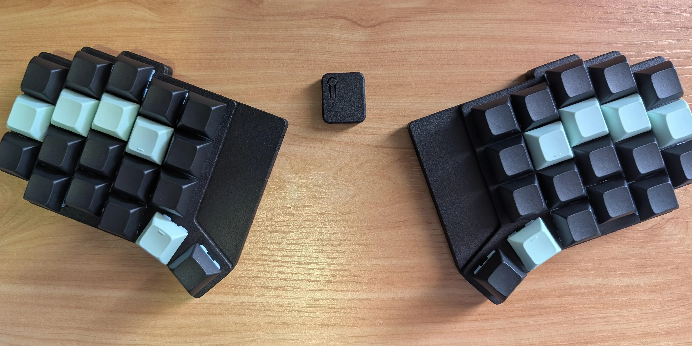
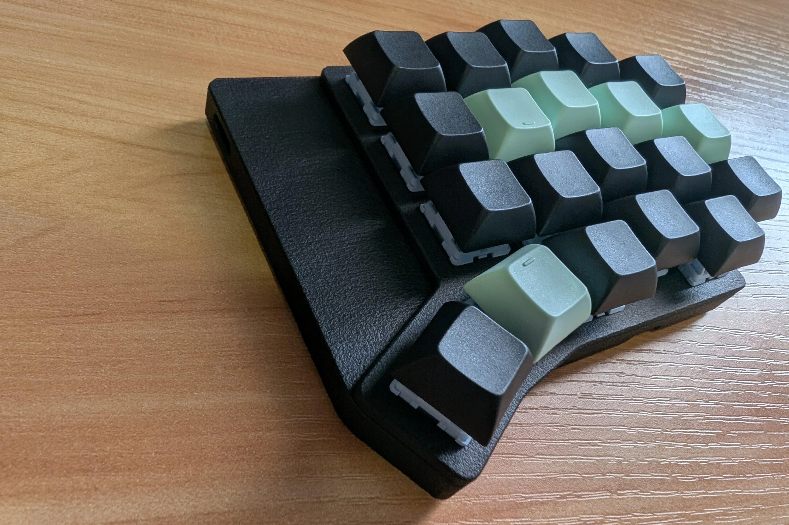
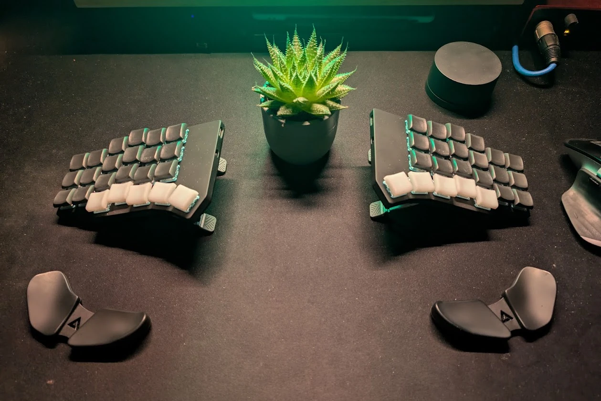
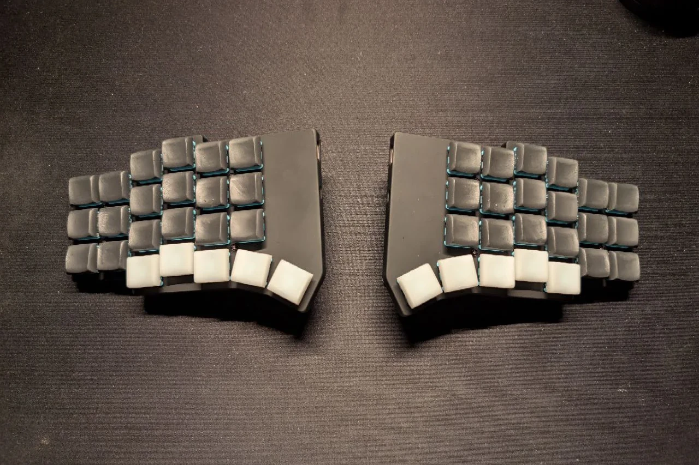
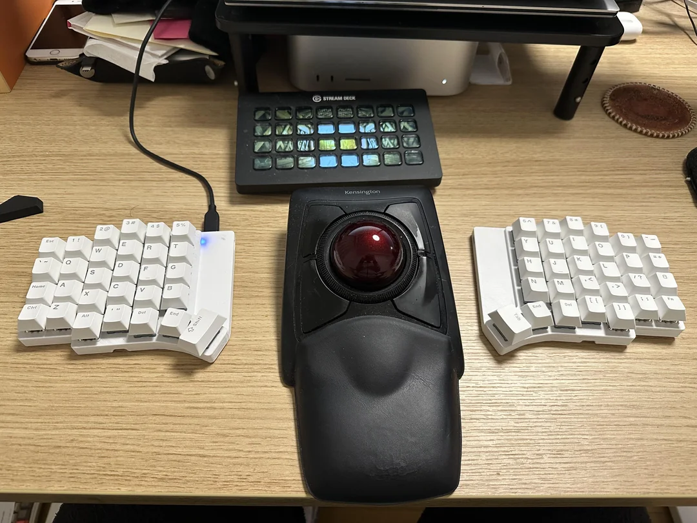
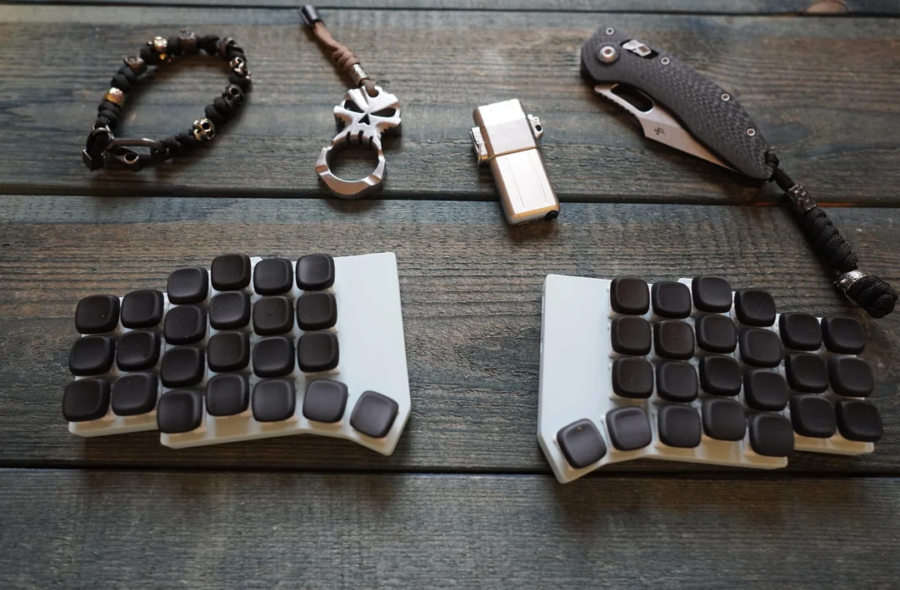
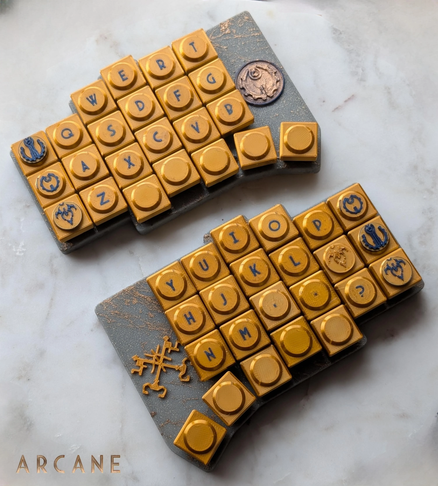
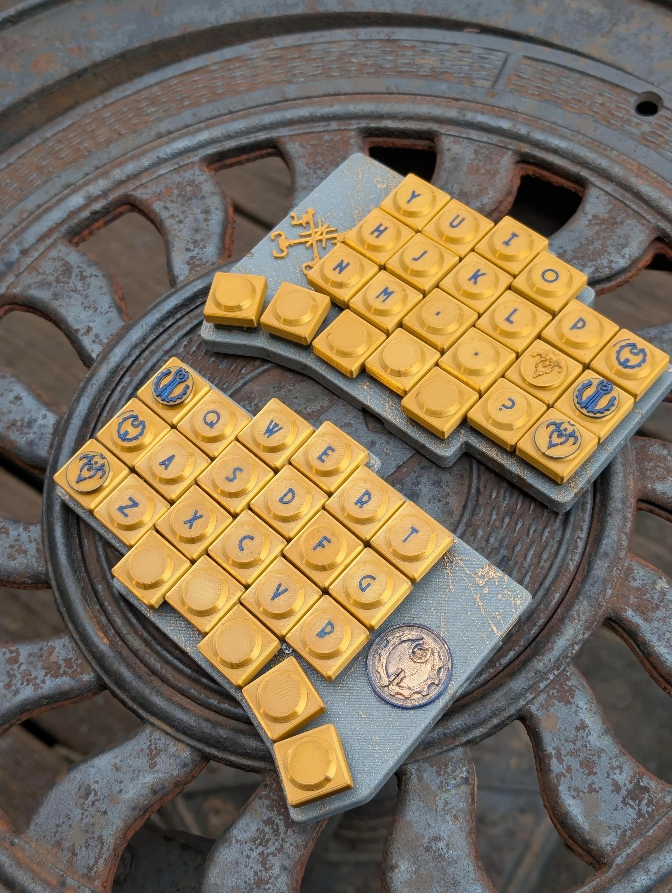
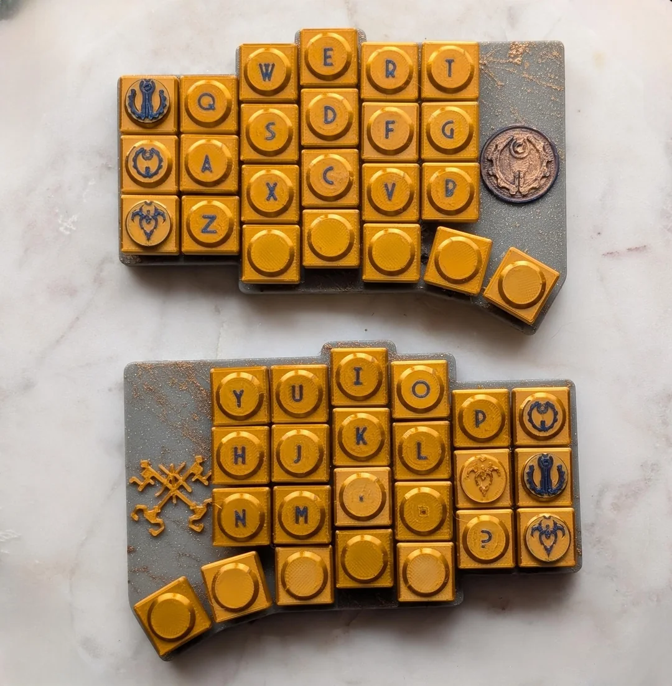

# Anywhy Flake Gallery

Welcome to the gallery, here you will find amazing Flake builds made by people. This page will be constantly expanding, so if you have a build you want to share, feel free to contact me and I'll add it here.

## by [@peppapighs](https://www.reddit.com/r/ErgoMechKeyboards/comments/1jbw0kt/my_custom_flake/)

Flake S with modified PCB adding through-holes for MCU mounting

## by [@caiodelgado](https://www.reddit.com/r/ErgoMechKeyboards/comments/1iz07kw/anywhy_flake_choc_v1_robinsunset_tenting/)

Flake with Choc v1 Robin switches, 3d-printed keycaps and tenting legs

## by [@kurisutofujp](https://www.reddit.com/r/ErgoMechKeyboards/comments/1iirgyt/comment/mb9034h/)

Snow-white Flake L with MX switches

## by [@devpew](https://www.reddit.com/r/ErgoMechKeyboards/comments/1ieevvh/flake/)

Clean white Flake M with black keyscaps

## by [@CaptLynx](https://www.reddit.com/r/ErgoMechKeyboards/comments/1ic3nkc/caitlynarcane_themed_anywhy_flake/)

The design is inspired by Caitlin, a character from the Arcane series.

